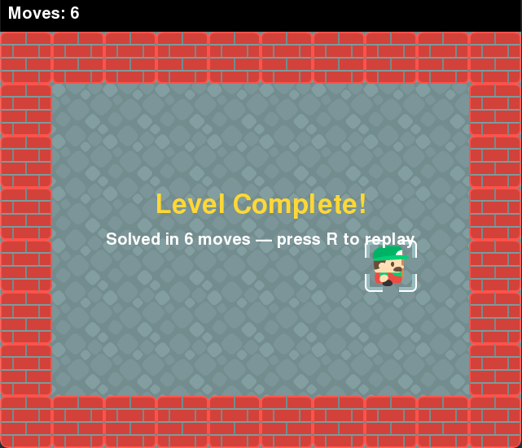
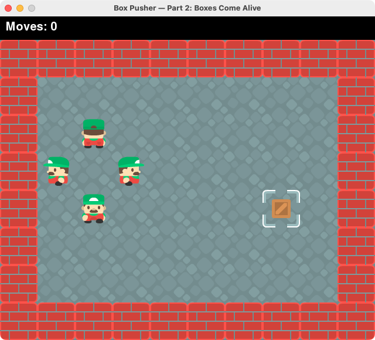

> **File làm việc:** `box_pusher.py` trong thư mục `week_7/`.
> Nhớ mở terminal và chạy file ngay trong thư mục `week_7/` để Pygame tìm thấy các file ảnh nhé!
> **Giữ thật kỹ file này** — tuần sau chúng ta sẽ tiếp tục xây dựng game Sokoban hoàn chỉnh từ chính nó.

---

## Nhiệm vụ 1: Bảng điểm (HUD) và Dòng chữ Thắng cuộc

### 1. Yêu cầu cụ thể
- **Bảng điểm ở dải đen trên cùng:** Hiển thị số bước chân của người chơi, ví dụ: `Moves: 0`. Mỗi khi bước đi thành công một ô, số này tự tăng lên. Đụng tường thì không tăng!
- **Dòng chữ chiến thắng:** Khi nhân vật đi vào ô đích (ô `.`), game dừng lại và hiện dòng chữ chúc mừng (ví dụ: `"You made it!"` hoặc `"Chiến thắng!"`) nổi bật ở **chính giữa màn hình**.
- *Lưu ý:* Chưa cần làm phím `R` để chơi lại (chúng ta sẽ để dành cho tuần sau).


> 📷 *Hình ảnh kết quả mẫu:*
> *(Bảng điểm hiện số bước chân trên dải đen + Dòng chữ vàng xuất hiện giữa màn hình khi thắng)*

---

### 2. Kiến thức cần nhớ & Gợi ý thực hiện

#### A. Cách vẽ chữ trong Pygame (3 bước)
Pygame không có lệnh `draw_text()` trực tiếp, mà ta biến chữ thành một tấm ảnh (Surface) rồi dán lên màn hình:

1. **Tạo Font chữ (làm 1 lần ở đầu game, sau `pygame.init()`):**
   ```python
   font = pygame.font.SysFont(font_name, font_size)
   ```
   *Gợi ý:* Em nên tạo 2 font: một font nhỏ (khoảng cỡ 30) cho bảng điểm, một font to (khoảng cỡ 48) cho chữ chúc mừng. Nếu để `None` ở tên font, Pygame sẽ dùng font mặc định.

2. **Render chữ (biến chữ thành ảnh):**
   ```python
   text_img = font.render(text, True, color)
   ```
   *Tham số `True` giúp viền chữ mượt mà, không bị răng cưa.*

3. **Blit (dán ảnh chữ lên màn hình):**
   ```python
   surface.blit(text_img, (x, y))
   ```

#### B. Vẽ vào đâu trong code?
- **Vẽ bảng điểm:** Hãy vẽ ở ngay phần đầu của method `World.draw(self, screen)`.
  - *Câu hỏi suy nghĩ:* Chữ bảng điểm nên dán vào `screen` hay `self.surface`? Nhớ lại xem dải đen 40 pixel (`MAP_TOP`) nằm ở đâu trên cửa sổ game!
  - Lấy số bước chân từ đâu? Nhớ là `self.player` đang tự giữ biến đếm bước chân của chính mình.
- **Vẽ dòng chữ chiến thắng:** Hãy vẽ ở cuối method `World.draw(self, screen)`, sau khi toàn bộ bản đồ và nhân vật đã vẽ xong.
  - Cần kiểm tra điều kiện gì trước khi vẽ chữ chúc mừng? (Gợi ý: thuộc tính `self.done` của World).
  - *Mẹo căn giữa màn hình:* Để chữ nằm ngay chính giữa trục ngang:
    ```python
    x = (screen_width - text_img.get_width()) // 2
    ```

---

## Nhiệm vụ 2: Nhân vật biết quay mặt theo 4 hướng

### 1. Yêu cầu cụ thể
Nhân vật hiện tại chỉ nhìn chằm chằm về phía camera. Em hãy làm cho nhân vật quay mặt đúng theo hướng vừa bấm di chuyển:
- **Đi xuống** (phím S / Mũi tên xuống): nhìn thẳng về phía trước.
- **Đi lên** (phím W / Mũi tên lên): quay lưng lại.
- **Đi sang phải** (phím D / Mũi tên phải): quay mặt sang phải.
- **Đi sang trái** (phím A / Mũi tên trái): quay mặt sang trái.
- **Đặc biệt:** Kể cả khi trước mặt là bức tường và không bước đi được, nhân vật vẫn phải biết **quay mặt về phía bức tường đó**!


> 📷 *Hình ảnh kết quả mẫu:*
> *(Nhân vật quay mặt theo 4 hướng: nhìn trước, quay lưng, nhìn phải, nhìn trái)*

---

### 2. Kiến thức cần nhớ & Gợi ý thực hiện

#### A. Nhân vật đang có những ảnh nào?
Trong thư mục `week_7/` đã chuẩn bị sẵn 3 file ảnh:
- `player_front.png` (nhìn thẳng)
- `player_back.png` (quay lưng)
- `player_side.png` (nhìn sang phải)

*Ủa, vậy ảnh nhìn sang trái ở đâu?*
Pygame có một hàm cực kỳ hữu ích giúp ta không cần vẽ thêm ảnh:
```python
new_img = pygame.transform.flip(original_img, flip_x, flip_y)
```
- Nếu truyền `True, False`: tấm ảnh sẽ được **lật theo chiều ngang** (trái thành phải, phải thành trái).
- *Gợi ý:* Hãy lật ảnh `player_side.png` để tạo ra hình nhân vật nhìn sang trái!

#### B. Quy tắc: "Ai vẽ ảnh thì tự nạp ảnh"
- Trong `Player.__init__`, thay vì chỉ nạp mỗi `player_front.png`, em hãy nạp sẵn toàn bộ các tư thế ảnh và lưu vào các thuộc tính riêng (ví dụ: `self.img_front`, `self.img_back`, `self.img_side_right`, `self.img_side_left`).
- Biến `self.img` sẽ là tấm ảnh hiện tại đang được mặc. Method `draw()` chỉ việc vẽ `self.img` ra màn hình như cũ, không cần sửa gì cả!

#### C. Đổi ảnh trong `move(self, dr, dc)`
- Nhớ lại quy ước toạ độ lưới:
  - `dr` (thay đổi hàng): `dr = -1` là đi **lên**, `dr = 1` là đi **xuống**.
  - `dc` (thay đổi cột): `dc = -1` là sang **trái**, `dc = 1` là sang **phải**.
- Trong method `move`, dựa vào giá trị của `dr` và `dc`, em gán lại `self.img` bằng tấm ảnh tương ứng.
- *Câu hỏi suy nghĩ:* Để nhân vật vẫn quay mặt dù bị tường chặn, đoạn code đổi `self.img` nên nằm **trước** hay **sau** câu lệnh kiểm tra tường `world.wall_at`?

---

## Bảng tự kiểm tra (Checklist)

Sau khi làm xong, em hãy tự kiểm tra xem code của mình đã đạt hết các tiêu chí này chưa nhé:

- [ ] Khi chạy game, dải đen phía trên hiển thị `Moves: 0`.
- [ ] Đi một bước thành công thì số `Moves` tăng lên 1. Đâm vào tường thì số không tăng.
- [ ] Bấm W/A/S/D (hoặc phím mũi tên) nhân vật quay mặt đúng 4 hướng.
- [ ] Đi lại đâm vào tường: nhân vật không đi xuyên tường nhưng vẫn quay mặt về phía tường đó.
- [ ] Khi đi vào ô đích `.`, dòng chữ chiến thắng xuất hiện rõ ràng giữa màn hình.

---

## Gợi ý gỡ lỗi (Debugging Tips)

| Vấn đề gặp phải | Gợi ý kiểm tra |
|---|---|
| Báo lỗi `NameError: name 'font' is not defined` | Em đã tạo biến `font` ở ngoài hàm chưa? Nhớ là code chạy từ trên xuống dưới, chỗ tạo font phải nằm trước dòng `world = World(...)`. |
| Chữ biến mất hoặc bị nền đen/gạch che mất | Em có đang dán chữ vào `self.surface` không? Hãy dán thẳng lên `screen` nhé. |
| Chữ bị báo lỗi `pygame.error: Font not initialized` | Dòng tạo font phải nằm **sau** dòng `pygame.init()`. |
| Nhân vật bị nền đen xung quanh người | Nhớ thêm `.convert_alpha()` khi dùng `pygame.image.load(...)`. |
| Nhân vật sang trái bị lộn ngược đầu | Kiểm tra lại 2 giá trị trong `pygame.transform.flip(img, flip_x, flip_y)`. Chiều dọc phải là `False` nhé! |
| Đâm vào tường không quay mặt được | Đoạn code đổi `self.img` có đang bị nằm sau câu lệnh kiểm tra tường không? |
